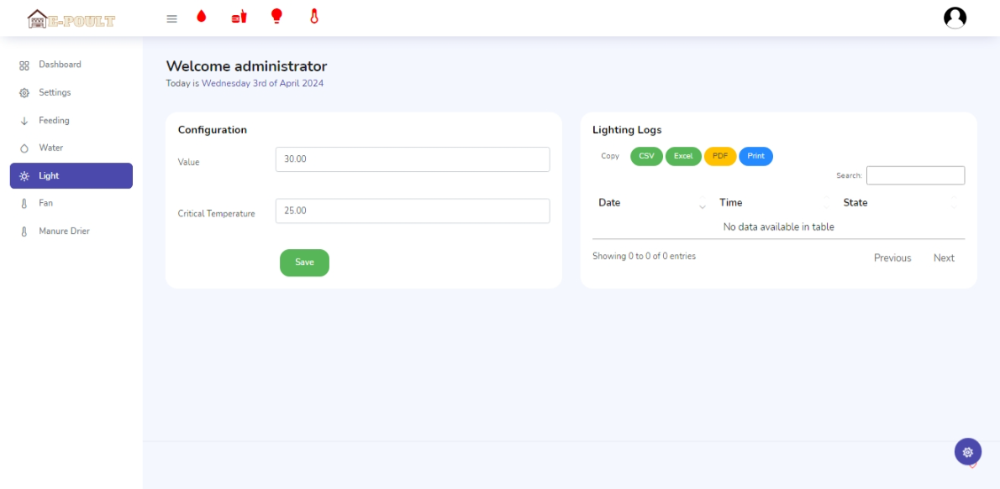

# auth

## login

## forgot password

# admin
## dashboad

- cards for statuses

## settings

- sms configuration
    - semaphore api
    - master number

## feeding

- feeding time management
- tank configuration(levels)

## water

- water tank config
- refill logs
- waterer level logs
- water tank level logs

## light

- configuration
- logs

## fan

- configuration
- fan logs
- DHT sensor readings

## manure dryer

- manual (seconds)
- heating logs

- configuration
- fan
- header
    - status bar of devices connected
    - logo
    - profile
- floating skin settings